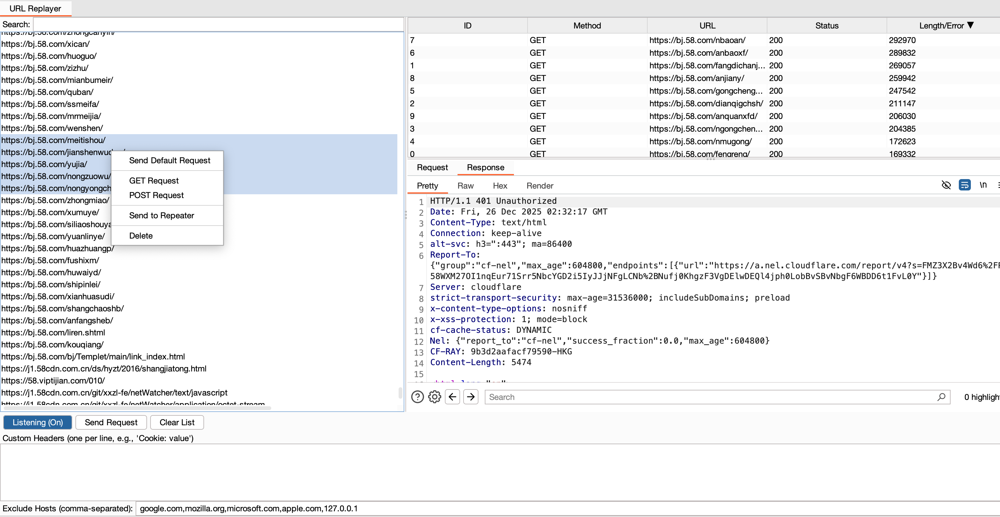

# URLReplayer

URLReplayer现已合并到Burp_Parsing

# Burp_Parsing

一个用于自动化 **API 接口提取、参数解析及批量验证** 的 Burp Suite 插件。旨在从 HTTP 响应中快速挖掘未公开的 API 端点并进行有效性测试。

## ✨ 核心功能

### 1. Analysis (Parsing) - 智能提取与构造
* **被动提取**：通过右键菜单 `Extract to API Hunter`，自动从 HTTP 响应包中正则提取潜在的 API 路径（Endpoints）和参数。
* **请求重组**：自动将提取的接口重组为可测试的 HTTP 请求。
    * **智能填充**：自动识别 `page`, `id`, `size` 等常见参数并填充测试值。
    * **格式转换**：支持一键在 `GET` (Query String) 和 `POST` (JSON Body) 之间切换。
* **联动**：支持将重组后的请求发送至 Burp Repeater 或插件自带的 Batch Replayer。  
  

### 2. Batch Verification (Replayer) - 批量验证与扫描
* **被动监听**：支持开启 `Listening` 模式，实时监听 Proxy 流量，自动捕获响应中的 API 路径及 Swagger 文档定义的接口。
* **批量发包**：多线程并发测试捕获的接口，快速验证接口存活状态（Status Code）及响应长度。
* **过滤与配置**：
    * **智能过滤**：自动忽略静态资源（.js, .css, .png）及指定域名（如 google.com）。
    * **自定义头**：支持添加 Custom Headers（如 Auth Token）覆盖默认设置。
* **可视化结果**：提供结果表格排序，支持点击查看详细 Request/Response 报文。  

## 🚀 快速使用

1.  **加载插件**：在 Burp Extender 中加载 `Burp_Parsing.py` (需 Jython 环境)。
2.  **提取接口**：
    * 在 Proxy/Repeater 历史记录中，右键点击响应包 -> **Extract to API Hunter (Parsing)**。
3.  **分析与发送**：
    * 进入 **Analysis (Parsing)** 标签页，查看提取结果。
    * 右键选中接口 -> **Send to Batch Replayer**。
4.  **批量验证**：
    * 进入 **Batch Verification (Replayer)** 标签页。
    * (可选) 填写 Custom Headers。
    * 点击 **Send Request (Batch)** 开始扫描。

## 👤 作者
[github.com/w-sega](https://github.com/w-sega)

## URLReplayer历史

### 使用方法
下载URLReplayer.py，在burp中添加extensions  

默认开启监听，shift可选中多个要测试的url，点击send。未配置请求头即默认来源的请求头包含cookie，右侧的请求列表右键可发送到repeater  

20251226更新  
  
支持了右键自由选择来源的默认请求、get post请求、发送到repeater、删除

1127更新  
  
支持了按响应长度排序

1028更新  

新增搜索功能、自定义请求头  

下方配置白名单地址  

自定义请求头  

