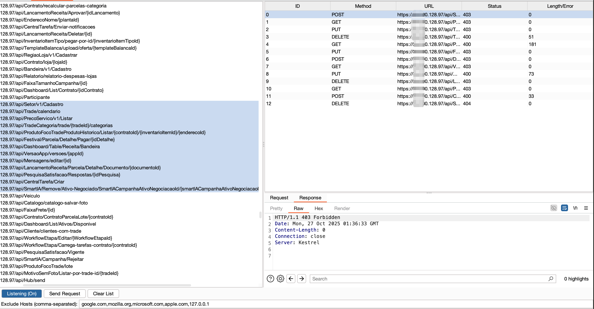
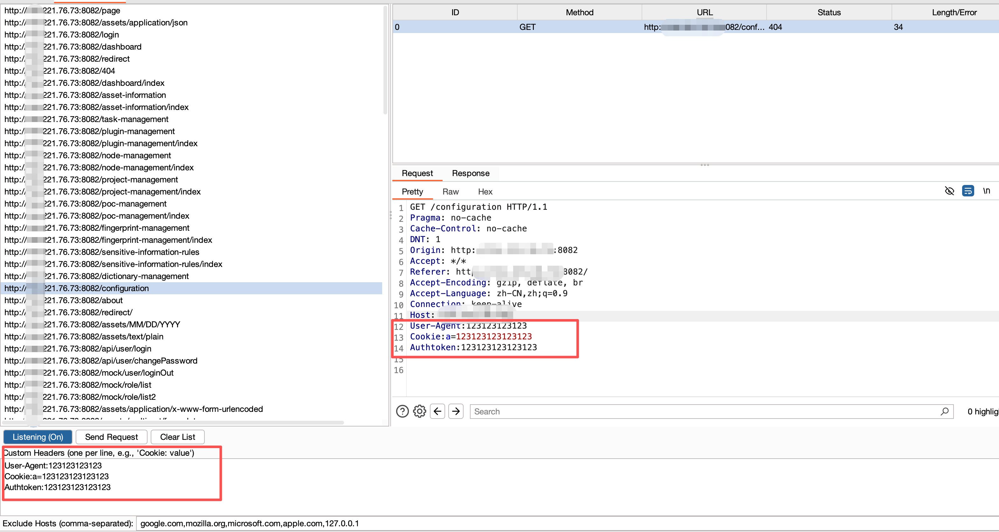

## URLReplayer

URLReplayer是一个burp插件，用于监听匹配所有响应中的接口，拼接来源地址，提供一键发送请求的功能，用于快速验证未授权漏洞，自动识别请求类型，不再需要从各种插件中复制接口到intruder中遍历爆破

### 使用方法
下载URLReplayer.py，在burp中添加extensions  

默认开启监听，选中要测试的url，点击send。右侧的请求列表右键可发送到repeater  

1028更新  

新增搜索功能、自定义请求头  

下方配置白名单地址  

自定义请求头  

